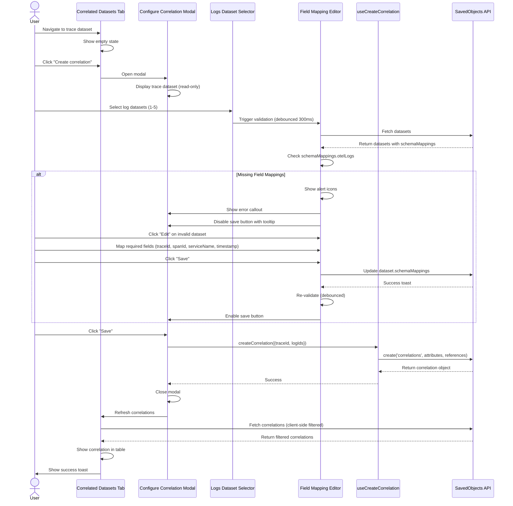
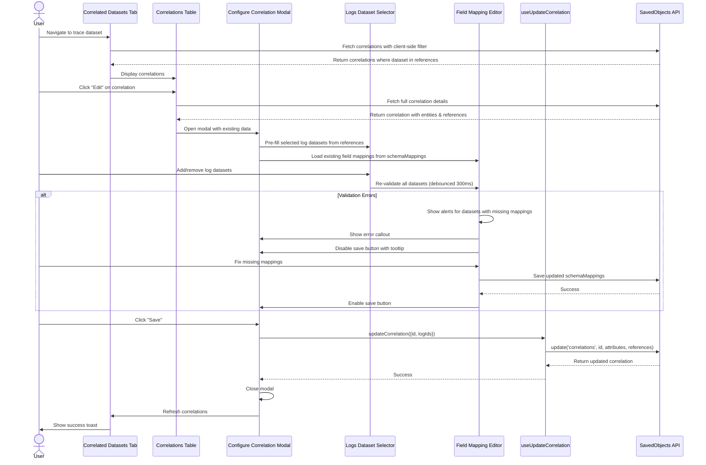
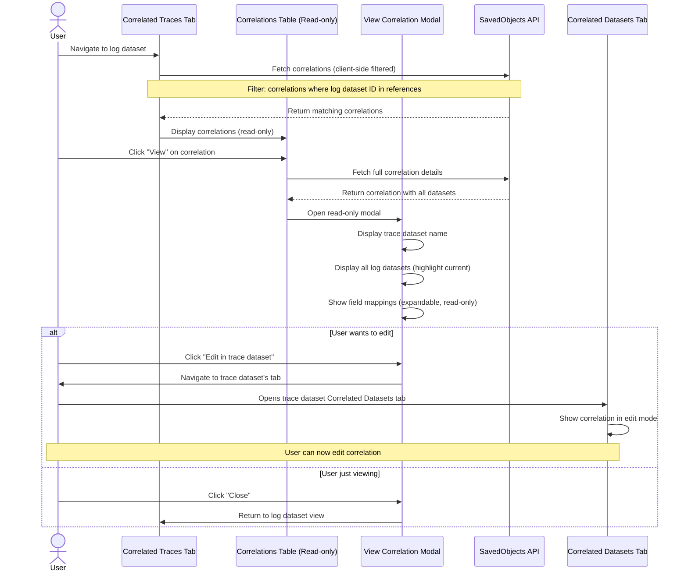
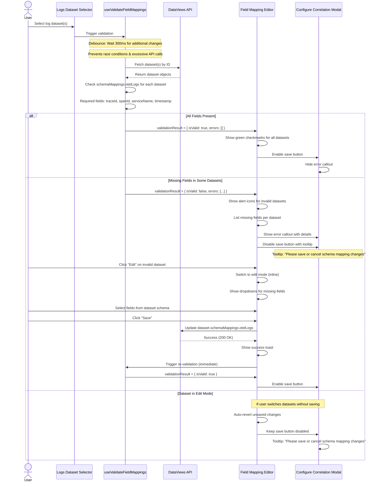

# Design Document: Trace-to-Logs Correlation Feature

**Version:** 1.0
**Date:** October 2025
**Status:** Implemented

---

## 1. Overview

### Purpose
The Trace-to-Logs Correlation feature enables users to create and manage relationships between trace datasets and log datasets within OpenSearch Dashboards. This feature enhances observability by allowing users to correlate distributed traces with corresponding application logs for comprehensive system analysis.

### Scope
This feature provides:
- **Create/Edit/Delete** correlation workflows from trace datasets (full CRUD operations)
- **Read-only view** of correlations from log datasets
- **Inline field mapping configuration** with real-time validation
- **Client-side validation** ensuring data integrity before persistence
- **Comprehensive error handling** and user guidance

### Technical Approach
- **Frontend-only implementation** using OpenSearch Dashboards' public SavedObjects API
- **No custom server routes** required - leverages existing saved object infrastructure
- **Saved object type** `correlations` already registered in the data plugin
- **Client-side filtering** to work around API limitations
- **Debounced validation** to prevent race conditions and excessive API calls

### Key Features
- ✅ Single correlation per trace dataset (business rule enforcement)
- ✅ Maximum 5 log datasets per correlation
- ✅ Required field mappings: `traceId`, `spanId`, `serviceName`, `timestamp`
- ✅ Real-time validation with debouncing (300ms)
- ✅ Contextual tooltips for disabled states
- ✅ Full i18n support
- ✅ Workspace isolation via SavedObjects

---

## 2. Requirements

### 2.1 Functional Requirements

#### FR-1: Correlation Management (Trace Datasets)
- **FR-1.1**: Users can create a new correlation from a trace dataset's "Correlated datasets" tab
- **FR-1.2**: Users can edit an existing correlation to add/remove log datasets
- **FR-1.3**: Users can delete a correlation with confirmation
- **FR-1.4**: Empty state prompts users to create their first correlation
- **FR-1.5**: Correlations table displays correlation details with edit/delete actions

#### FR-2: Correlation Viewing (Log Datasets)
- **FR-2.1**: Users can view correlations from a log dataset's "Correlated traces" tab (read-only)
- **FR-2.2**: Users can navigate to trace dataset to edit the correlation
- **FR-2.3**: View modal shows all correlated datasets with current dataset highlighted
- **FR-2.4**: Field mappings are viewable but not editable from log dataset view

#### FR-3: Field Mapping Configuration
- **FR-3.1**: Users can configure required field mappings inline during correlation creation/editing
- **FR-3.2**: System validates that all required fields are mapped before allowing save
- **FR-3.3**: System auto-populates existing `schemaMappings.otelLogs` if available
- **FR-3.4**: Users can edit field mappings for datasets with missing or incorrect mappings
- **FR-3.5**: Changes to field mappings are saved to the dataset's `schemaMappings` immediately

#### FR-4: Validation Rules
- **FR-4.1**: A trace dataset can only be part of **one** correlation
- **FR-4.2**: A correlation can contain a maximum of **5** log datasets
- **FR-4.3**: All selected log datasets must have complete field mappings:
  - `traceId` - maps to trace identifier field
  - `spanId` - maps to span identifier field
  - `serviceName` - maps to service/application name field
  - `timestamp` - maps to event timestamp field
- **FR-4.4**: Only datasets with `signalType='logs'` can be selected as log datasets
- **FR-4.5**: Correlation save button is disabled until all validation passes

### 2.2 Non-Functional Requirements

#### NFR-1: Performance
- **NFR-1.1**: Field mapping validation is debounced by 300ms to prevent race conditions
- **NFR-1.2**: Client-side filtering reduces unnecessary API calls
- **NFR-1.3**: Correlation fetching uses pagination (perPage: 100)
- **NFR-1.4**: Tab loading is lazy - data fetched only when tab is active

#### NFR-2: Usability
- **NFR-2.1**: Disabled save button shows contextual tooltip explaining why it's disabled
- **NFR-2.2**: Validation errors are displayed inline with specific field details
- **NFR-2.3**: Success/error toasts provide feedback for all mutations
- **NFR-2.4**: Empty states guide users to create their first correlation
- **NFR-2.5**: Error callouts highlight validation issues with actionable guidance

#### NFR-3: Maintainability
- **NFR-3.1**: 72 unit tests with comprehensive coverage (validation, CRUD, hooks)
- **NFR-3.2**: All user-facing text uses i18n for internationalization
- **NFR-3.3**: TypeScript interfaces for type safety
- **NFR-3.4**: Modular component structure for easy maintenance

#### NFR-4: Reliability
- **NFR-4.1**: Client-side filtering ensures correct correlation display
- **NFR-4.2**: Debouncing prevents race conditions in validation
- **NFR-4.3**: Error boundaries prevent UI crashes
- **NFR-4.4**: Graceful error handling for API failures

---

## 3. Object Type and Schema

### 3.1 Correlation Saved Object

**Type:** `correlations`
**Namespace:** Workspace-scoped via SavedObjects

### 3.2 Schema Structure

```typescript
interface CorrelationAttributes {
  correlationType: string;  // 'Traces-Logs-Correlation'
  version: string;          // '1.0.0'
  entities: Array<{
    tracesDataset?: { id: string };  // references[0].id
    logsDataset?: { id: string };    // references[n].id
  }>;
}

interface CorrelationSavedObject extends SavedObject<CorrelationAttributes> {
  type: 'correlations';
  references: SavedObjectReference[];  // Array of index-pattern references
}
```

### 3.3 References Array Structure

The `references` array stores relationships to index-pattern (dataset) IDs:
- **Position 0**: Trace dataset (owner of the correlation)
- **Positions 1-5**: Log datasets (participants in the correlation)

```json
{
  "references": [
    {
      "name": "entities[0].index",
      "type": "index-pattern",
      "id": "trace-dataset-id"
    },
    {
      "name": "entities[1].index",
      "type": "index-pattern",
      "id": "log-dataset-1-id"
    },
    {
      "name": "entities[2].index",
      "type": "index-pattern",
      "id": "log-dataset-2-id"
    }
  ]
}
```

### 3.4 Example Correlation Object

```json
{
  "type": "correlations",
  "id": "traces-logs-correlation",
  "attributes": {
    "correlationType": "Traces-Logs-Correlation",
    "version": "1.0.0",
    "entities": [
      {
        "tracesDataset": {
          "id": "references[0].id"
        }
      },
      {
        "logsDataset": {
          "id": "references[1].id"
        }
      }
    ]
  },
  "references": [
    {
      "name": "entities[0].index",
      "type": "index-pattern",
      "id": "f0939ef0-a08b-11f0-b8b3-010e18331231::otel-traces"
    },
    {
      "name": "entities[1].index",
      "type": "index-pattern",
      "id": "f0939ef0-a08b-11f0-b8b3-010e1833448f::sample-logs"
    }
  ],
  "workspaces": ["workspace-id"],
  "updated_at": "2025-10-13T22:38:18.974Z",
  "version": "WzI2NDYsMjRd"
}
```

### 3.5 Field Mappings (Dataset Schema)

Field mappings are stored in each dataset's `schemaMappings.otelLogs` field:

```json
{
  "schemaMappings": {
    "otelLogs": {
      "traceId": "traceId",
      "spanId": "spanId",
      "serviceName": "attributes.aws.remote.service",
      "timestamp": "startTimeUnixNano"
    }
  }
}
```

---

## 4. UI Mocks

*Links to UI mocks will be added in the Appendix section.*

---

## 5. Workflows

### 5.1 Create Correlation Flow (Trace Dataset)



---

### 5.2 Edit Correlation Flow (Trace Dataset View)



---

### 5.3 View Correlation Flow (Log Dataset View)



---

### 5.4 Field Mapping Validation Flow



---

## 6. Testing

### 6.1 Test Coverage Summary

**Total Tests: 72 passing ✅**

The correlation feature has comprehensive unit test coverage across all critical components:

| Test File | Tests | Coverage Areas |
|-----------|-------|----------------|
| `correlation_validation.test.ts` | 32 | Business rule validation, field mapping checks |
| `correlations_client.test.ts` | 21 | SavedObjects CRUD operations, reference handling |
| `use_correlations.test.ts` | 19 | React hooks, data fetching, client-side filtering |

### 6.2 Test Breakdown

#### 6.2.1 Validation Tests (32 tests)
**File:** `src/plugins/dataset_management/public/utils/correlation_validation.test.ts`

- **validateCorrelationConstraints** (5 tests)
  - Returns valid when trace dataset is not in any correlation
  - Returns invalid when trace dataset is already in another correlation
  - Skips current correlation when editing (currentCorrelationId provided)
  - Handles empty correlations array
  - Handles multiple correlations and finds conflict

- **validateMaxLogDatasets** (4 tests)
  - Returns valid for 1 log dataset
  - Returns valid for max allowed log datasets (5)
  - Returns invalid when exceeding max log datasets
  - Returns invalid when no log datasets are selected

- **checkMissingFieldMappings** (8 tests)
  - Returns empty array when all required fields are present
  - Returns missing fields when some are not present
  - Returns all required fields when otelLogs is missing
  - Returns all required fields when schemaMappings is null
  - Handles schemaMappings as JSON string
  - Returns all fields when JSON parsing fails
  - Detects empty string values as missing

- **validateFieldMappings** (3 tests)
  - Returns valid result when all datasets have complete mappings
  - Returns invalid result with errors when some datasets have missing fields
  - Handles empty datasets array

- **Helper Functions** (12 tests)
  - getRequiredFields, hasValidFieldMappings, getFieldMappingErrorMessage
  - isValidLogsDataset, isValidTraceDataset

#### 6.2.2 SavedObjects Client Tests (21 tests)
**File:** `src/plugins/dataset_management/public/services/correlations_client.test.ts`

- **find()** (4 tests)
  - Finds all correlations without filter
  - Finds correlations filtered by dataset ID
  - Supports pagination options
  - Handles empty results

- **get()** (2 tests)
  - Gets a single correlation by ID
  - Throws error when correlation not found

- **create()** (3 tests)
  - Creates a new correlation with correct structure
  - Creates correlation with single log dataset
  - Allows custom correlationType and version

- **update()** (2 tests)
  - Updates correlation with new log datasets
  - Preserves trace dataset when updating

- **delete()** (2 tests)
  - Deletes a correlation by ID
  - Handles delete errors

- **Helper Methods** (8 tests)
  - getCorrelationsForDataset, countForDataset
  - isTraceDatasetCorrelated, getCorrelationByTraceDataset

#### 6.2.3 React Hooks Tests (19 tests)
**File:** `src/plugins/dataset_management/public/hooks/use_correlations.test.ts`

- **useCorrelations** (6 tests)
  - Fetches correlations successfully
  - Filters correlations by dataset ID (client-side)
  - Handles fetch errors
  - Handles non-Error exceptions
  - Supports refetch functionality
  - Refetches when options change

- **useCorrelationCount** (7 tests)
  - Returns count of correlations
  - Returns 0 when no dataset ID provided
  - Returns 0 when no correlations found
  - Handles fetch errors
  - Supports refetch functionality
  - Uses perPage: 1000 for count query
  - Refetches when datasetId changes

- **useSingleCorrelation** (6 tests)
  - Fetches single correlation by ID
  - Returns null when no correlation ID provided
  - Handles fetch errors
  - Handles non-Error exceptions
  - Refetches when correlation ID changes
  - Clears correlation when ID changes to undefined

### 6.3 Test Execution

Run all correlation tests:

```bash
# Run validation tests
yarn test:jest src/plugins/dataset_management/public/utils/correlation_validation.test.ts --maxWorkers=2

# Run SavedObjects client tests
yarn test:jest src/plugins/dataset_management/public/services/correlations_client.test.ts --maxWorkers=2

# Run React hooks tests
yarn test:jest src/plugins/dataset_management/public/hooks/use_correlations.test.ts --maxWorkers=2
```

**Expected Results:**
- correlation_validation.test.ts: 32 passing ✅
- correlations_client.test.ts: 21 passing ✅
- use_correlations.test.ts: 19 passing ✅
- **Total: 72 passing tests** ✅

### 6.4 Test Coverage Areas

✅ **Business Logic**
- All validation rules (max datasets, required fields, constraints)
- Field mapping validation including edge cases (JSON parsing, whitespace, empty values)
- Dataset type validation (traces vs logs)

✅ **Data Operations**
- All SavedObjects CRUD operations (create, read, update, delete)
- Reference resolution and dataset ID extraction
- Pagination and filtering

✅ **React Hooks**
- Data fetching with loading/error states
- Client-side filtering logic
- Refetch functionality
- State management

✅ **Edge Cases**
- Null/undefined handling
- Empty arrays and objects
- JSON parsing errors
- Concurrent operations

### 6.5 Future Testing

**Component Tests** (Deferred)
- UI component behavior and rendering
- User interactions and event handling
- Modal workflows
- Table operations

**E2E Tests** (Deferred - Cypress)
- Complete user workflows
- Integration between components
- Real API interactions
- State persistence

---

## 7. Security

### 7.1 Authentication & Authorization

The correlation feature leverages OpenSearch Dashboards' existing **SavedObjects permission system** without requiring custom security implementation.

#### 7.1.1 SavedObjects Security Model

**Access Control:**
- Correlations follow the standard SavedObjects access control model
- Users must have appropriate permissions on the `correlations` saved object type
- Permission checks are enforced by the SavedObjects API layer

**Permission Levels:**
- **Read**: View correlations in both trace and log dataset views
- **Write**: Create and update correlations (trace datasets only)
- **Delete**: Remove correlations (trace datasets only)

#### 7.1.2 Reference-Based Security

**Index Pattern References:**
Correlations use the `references` array to link to index-pattern (dataset) IDs. Security is enforced through these references:

```json
{
  "references": [
    {
      "name": "entities[0].index",
      "type": "index-pattern",
      "id": "trace-dataset-id"
    },
    {
      "name": "entities[1].index",
      "type": "index-pattern",
      "id": "log-dataset-id"
    }
  ]
}
```

**Security Implications:**
- Users can only create correlations referencing datasets they have access to
- If a user loses access to a referenced dataset, the correlation becomes inaccessible
- SavedObjects API validates reference integrity automatically

### 7.2 Workspace Isolation

**Workspace Scoping:**
Correlations are scoped to workspaces via the standard SavedObjects `workspaces` field:

```json
{
  "type": "correlations",
  "id": "correlation-123",
  "workspaces": ["workspace-abc"],
  "attributes": { ... }
}
```

**Isolation Guarantees:**
- Correlations are only visible within their assigned workspace(s)
- Cross-workspace correlation access is prevented by the SavedObjects API
- Workspace membership is enforced at the API layer

### 7.3 Data Validation

**Client-Side Validation:**
- All input is validated before sending to the API
- Business rules enforced (max 5 datasets, required fields)
- Prevents malformed data from reaching the backend

**Server-Side Validation:**
- SavedObjects API performs schema validation
- Reference integrity checks ensure valid dataset IDs
- Workspace access checks prevent unauthorized operations

### 7.4 No Custom Security Implementation

**Why No Custom Security:**
The correlation feature intentionally avoids custom security implementation because:

1. **Leverages Existing Infrastructure**: SavedObjects API already provides robust security
2. **Consistency**: Follows the same security model as other saved objects (dashboards, visualizations)
3. **Maintainability**: No additional security code to maintain or audit
4. **Compliance**: Inherits all compliance features from SavedObjects (audit logging, encryption at rest)

**Standard Permissions Applied:**
- User roles and permissions configured at the OpenSearch Dashboards level
- No correlation-specific permissions required
- Access control managed through existing role-based access control (RBAC)

### 7.5 Security Best Practices Followed

✅ **Input Validation**: All user inputs validated client-side and server-side
✅ **Reference Integrity**: Only valid dataset IDs can be referenced
✅ **Workspace Isolation**: Strict workspace boundaries enforced
✅ **No Direct Data Access**: All operations go through SavedObjects API
✅ **Audit Trail**: All mutations logged by SavedObjects API
✅ **Error Handling**: No sensitive information leaked in error messages

---

## 8. Appendix

### 8.1 UI Mocks

*Links to UI mockups and screenshots will be added here.*

### 8.2 Related Documentation

*Links to related documentation will be added here.*

### 8.3 Implementation Details

For detailed implementation information, see:
- `plan.md` - Complete implementation plan with phases and testing details
- `objective.md` - Original requirements and saved object examples

---

**Document Version History:**

| Version | Date | Author | Changes |
|---------|------|--------|---------|
| 1.0 | October 2025 | - | Initial design document |

