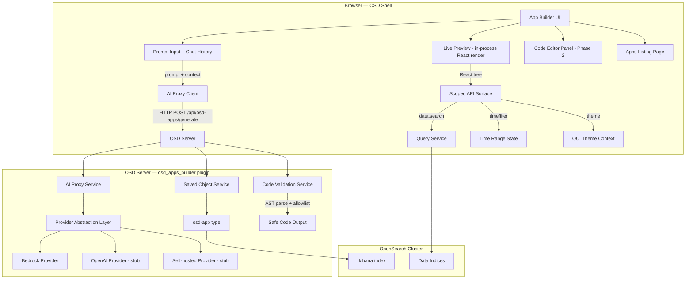

# OSD Apps Builder — High-Level Design

**Version:** 1.0  
**Status:** Draft  
**Date:** April 30, 2026  
**Plugin Location:** `src/plugins/osd_apps_builder/`

---

## Table of Contents

1. [Problem Statement](#1-problem-statement)
2. [Goals & Scope](#2-goals--scope)
3. [Design Decisions](#3-design-decisions)
4. [Architecture Overview](#4-architecture-overview)
5. [Saved Object Schema](#5-saved-object-schema)
6. [AI Provider Abstraction](#6-ai-provider-abstraction)
7. [Security Model](#7-security-model)
8. [Existing OSD Patterns Leveraged](#8-existing-osd-patterns-leveraged)
9. [Plugin Structure](#9-plugin-structure)
10. [Phase 1 — Foundation (Detailed)](#10-phase-1--foundation-detailed)
11. [Phase 2 — Iteration & Polish (High-Level)](#11-phase-2--iteration--polish-high-level)
12. [Phase 3 — Collaboration (High-Level)](#12-phase-3--collaboration-high-level)
13. [Open Questions & Risks](#13-open-questions--risks)
14. [Appendix A: AWS Quick App — iframe + Bridge Approach](#appendix-a-aws-quick-app--iframe--bridge-approach)

---

## 1. Problem Statement

OpenSearch Dashboards provides a rich but fundamentally static visualization layer. Dashboards are composed from a fixed set of panel types, arranged on a grid, and shared as read-only artifacts. Users cannot build bespoke interactive UIs without custom plugin development, and there is no mechanism to describe a desired interface in natural language and have OSD generate it.

Platforms like Lovable, v0 (Vercel), and Bolt.new have demonstrated that non-technical users can build fully functional web applications from natural language prompts. OSD users increasingly expect this same experience within their data and observability workflows.

**Gap:** OSD has no equivalent to prompt-driven, AI-assisted app building — leaving users to choose between rigid dashboards or expensive custom plugin development.

---

## 2. Goals & Scope

### Goals

- Users describe a UI in natural language → AI generates a functional OSD App using React/OUI + ECharts
- Iterative refinement via follow-up prompts
- OSD Apps persisted as `osd-app` saved objects with full CRUD, export/import, versioning
- Apps render inside the OSD shell, respecting theming, navigation, and data access constraints
- Multi-provider AI abstraction (Bedrock first), server-side only
- Apps query OpenSearch via existing query_enhancements patterns (PPL, PromQL)
- Apps support OpenSearch datasources and Prometheus direct query connections
- First-class "Apps" section in left navigation with listing, search, filter, deep links
- Secure rendering of AI-generated code via server-side AST validation

### Scope

| Phase | Coverage |
|-------|----------|
| Phase 1 — Foundation | Detailed task breakdown (this document) |
| Phase 2 — Iteration & Polish | High-level description |
| Phase 3 — Collaboration | High-level description |

### Non-Goals

- Does not replace the existing Dashboards experience
- No arbitrary server-side code execution in Phase 1
- No public app marketplace or cross-cluster sharing
- No mobile-first or native app output

---

## 3. Design Decisions

### 3.1 Rendering Approach — In-Process with Validation

Three industry approaches were evaluated for rendering AI-generated React code:

| Approach | Used By | How It Works | Pros | Cons |
|----------|---------|--------------|------|------|
| **WebContainer (WASM OS)** | Bolt.new, StackBlitz | Full Node.js runtime in browser via WebAssembly, isolated in Service Worker | Full Node.js compat, true isolation | Requires COEP/COOP headers, heavy (~10MB), browser compat issues, StackBlitz dependency |
| **Sandboxed iframe + bundler** | v0 (Vercel), CodeSandbox | Code transpiled/bundled, rendered in sandboxed `<iframe>` with `srcdoc`, communication via `postMessage` | Good isolation, CSP-compliant | Bundle duplication (~2MB OUI), theme sync overhead, flyouts can't escape iframe, async data round-trips |
| **In-process with validation** | Lovable (partial), Retool | Code transpiled in-process, validated/sanitized, rendered in the same React tree | Full theme/context access, no bundle duplication, simplest architecture | Requires robust server-side validation |

**Decision: In-process with validation.** Rationale:

1. **Native OUI integration** — Generated components inherit `EuiProvider` context (dark/light mode, spacing tokens) automatically. No theme sync protocol needed.
2. **Direct access to OSD services** — Generated apps use `data.search`, time range picker, filter bar, and query bar as React components in the same tree. This is how dashboard panels, vis_builder, and the APM component work today.
3. **No bundle duplication** — OUI + React + ECharts are already loaded in the OSD shell. An iframe needs its own copies.
4. **Consistent UX** — Flyouts, toasts, and modals from generated apps layer correctly with the OSD shell. An iframe cannot render flyouts beyond its boundary, breaking the patterns used in dashboards-observability.
5. **Precedent** — OSD already renders user-provided content in-process: Vega specs, Markdown visualizations, TSVB expressions.
6. **Security boundary is the validator, not the container** — The code is generated server-side by our AI proxy (not user-submitted arbitrary JS). Server-side AST validation is the real security boundary regardless of rendering approach.

### 3.2 AI Provider — Multi-Provider Abstraction, Bedrock First

- Provider interface defined from Day 1 supporting streaming responses (`AsyncIterable<string>`)
- Bedrock is the initial implementation using `@aws-sdk` (already in OSD dependencies)
- OpenAI and self-hosted provider stubs are registered but return "not configured" errors
- All AI calls are server-side only; API keys never exposed to the browser

### 3.3 Component Model — React + OUI + ECharts

- AI generates actual React/OUI component code (not a declarative JSON spec)
- ECharts for charting (already used in dashboards-observability)
- Generated code receives a **scoped API object** — not raw `core` services
- The transpiler rewrites imports to only allow the sanctioned API surface

---

## 4. Architecture Overview



### Key Architectural Principles

- **Saved objects, not services** — OSD Apps are stored as saved objects, inheriting OSD's backup, migration, multi-tenancy, and RBAC infrastructure with zero additional operational overhead.
- **Server-side AI only** — All LLM calls route through the OSD server. No model credentials or API keys are exposed to the browser.
- **In-process rendering with scoped API** — Generated code runs in the same React tree as OSD but receives only a constrained API surface (data queries, theme, time range). It cannot access raw `core` services, `localStorage`, `document.cookie`, or make external network requests.
- **Streaming generation** — AI responses stream to the client for real-time preview updates during generation.

---

## 5. Saved Object Schema

```typescript
// server/saved_objects/osd_app.ts
export const osdAppSavedObjectType: SavedObjectsType = {
  name: 'osd-app',
  hidden: false,
  namespaceType: 'single', // workspace-scoped, same as dashboard
  management: {
    icon: 'apps',
    defaultSearchField: 'title',
    importableAndExportable: true,
    getTitle: (obj) => obj.attributes.title,
    getEditUrl: (obj) =>
      `/management/opensearch-dashboards/objects/savedOsdApps/${encodeURIComponent(obj.id)}`,
    getInAppUrl: (obj) => ({
      path: `/app/osd-apps/view/${encodeURIComponent(obj.id)}`,
      uiCapabilitiesPath: 'osdApps.show',
    }),
  },
  mappings: {
    properties: {
      title:          { type: 'text' },
      description:    { type: 'text' },
      author:         { type: 'keyword' },
      version:        { type: 'integer' },
      sourceCode:     { type: 'text', index: false },
      dataSourceRefs: { type: 'text', index: false },  // JSON array of { id, type, title }
      promptHistory:  { type: 'text', index: false },   // JSON array of prompt/response pairs
      tags:           { type: 'keyword' },
      createdAt:      { type: 'date' },
      updatedAt:      { type: 'date' },
    },
  },
  migrations: {},
};
```

The `namespaceType: 'single'` ensures apps are automatically scoped to the active workspace in workspace-aware deployments (FR-041), following the same pattern as the `dashboard` saved object type.

---

## 6. AI Provider Abstraction

```typescript
// server/services/ai_proxy_service.ts
interface AIProvider {
  id: string;
  generateApp(prompt: string, context: AppGenerationContext): AsyncIterable<string>;
  refineApp(prompt: string, existingCode: string, context: AppGenerationContext): AsyncIterable<string>;
}

interface AppGenerationContext {
  indexMetadata?: IndexMetadata[];   // Available indices + field mappings
  dataSourceRefs?: DataSourceRef[];  // Connected datasources (OpenSearch, Prometheus)
  existingCode?: string;             // Current app code for refinement
  componentLibrary: 'oui+echarts';   // Available component set
}

interface IndexMetadata {
  title: string;           // e.g., "nginx-logs-*"
  fields: FieldMapping[];  // field name, type, aggregatable
}

interface DataSourceRef {
  id: string;
  type: 'DATA_SOURCE' | 'PROMETHEUS';  // OpenSearch datasource or Prometheus direct query
  title: string;
}
```

The `AppGenerationContext` provides the AI model with schema awareness — it knows what indices exist, what fields are available, and what data source connections are configured. This enables the model to generate correct PPL/PromQL queries targeting real data.

**Streaming:** Both `generateApp` and `refineApp` return `AsyncIterable<string>`, enabling the server route to stream chunks to the client as they arrive from the LLM. The client renders partial code updates in real-time.

---

## 7. Security Model

Since generated code runs in-process (same React tree as OSD), security relies on a **layered validation approach**:

### 7.1 Server-Side AST Validation (Primary Boundary)

All AI-generated code is parsed into an AST (using Babel parser) on the server before being returned to the client. The validator enforces:

**Blocked patterns (reject with error):**

| Pattern | Reason |
|---------|--------|
| `eval()`, `new Function()` | Arbitrary code execution |
| `document.cookie`, `document.domain` | Session/credential theft |
| `localStorage`, `sessionStorage` direct access | Cross-tenant data access |
| `fetch()`, `XMLHttpRequest`, `WebSocket` to external URLs | Data exfiltration |
| `innerHTML`, `outerHTML` assignment | DOM-based XSS |
| `dangerouslySetInnerHTML` without sanitization | React XSS escape hatch |
| `window.location` assignment | Navigation hijacking |
| `import()` dynamic imports outside allowlist | Arbitrary module loading |

**Allowed imports (allowlist):**

| Module | What's Exposed |
|--------|---------------|
| `@elastic/eui` (OUI) | All OUI components |
| `echarts` / `echarts-for-react` | Charting library |
| `react`, `react-dom` | React core |
| `@osd-apps/api` | Scoped API surface (data queries, theme, time range) |

### 7.2 Client-Side Re-Validation

Before rendering, the client re-validates the code AST as a defense-in-depth measure. This catches any code that was modified in transit or loaded from a saved object that predates a validation rule update.

### 7.3 Scoped API Surface

Generated code does not receive raw `core` services. Instead, it receives a constrained API object:

```typescript
// The API surface available to generated apps
interface OsdAppApi {
  // Data queries — proxied through data.search
  search(params: { query: string; language: 'PPL' | 'PromQL'; dataset: DatasetConfig }): Promise<SearchResponse>;

  // Theme — read-only
  theme: { isDarkMode: boolean; euiTheme: EuiThemeComputed };

  // Time range — read-only, synced with OSD time picker
  timeRange: { from: string; to: string; refreshInterval?: number };

  // Navigation — constrained
  navigateToApp(appId: string, options?: { path?: string }): void;
}
```

### 7.4 Crash Isolation

Generated apps are wrapped in a `React.ErrorBoundary` that catches render errors and displays a fallback UI without crashing the OSD shell. A timeout mechanism detects infinite loops during initial render.

---

## 8. Existing OSD Patterns Leveraged

| Pattern | Source | How We Use It |
|---------|--------|---------------|
| **Saved object type registration** | `src/plugins/dashboard/server/saved_objects/dashboard.ts` | Register `osd-app` type with mappings, migrations, management metadata via `core.savedObjects.registerType()` |
| **Application registration** | 18+ plugins using `core.application.register()` | Register App Builder, App Viewer, and Apps Listing as OSD applications |
| **Capabilities & permissions** | `src/plugins/dashboard/server/plugin.ts` | Use `core.capabilities.registerProvider()` and `registerSwitcher()` for `osdApps.show`, `osdApps.createNew` |
| **Query & data access** | `src/plugins/query_enhancements/` + dashboards-observability APM | Use `data.search` with dataset config `{ dataSource: { id, type }, title, type }` for PPL and PromQL queries |
| **Flyout patterns** | `plugins/dashboards-observability/public/components/common/flyout_containers/` | Composable flyout for prompt history, version history, component property editors |
| **Filter/time/query bar** | `src/plugins/data/public/ui/search_bar/`, `filter_bar/`, `query_string_input/` | Optional shared state for generated apps (FR-023) |
| **Left nav registration** | `src/plugins/workspace/public/plugin.ts`, `src/plugins/discover/public/plugin.ts` | Register "Apps" section in left navigation |
| **Data source integration** | dashboards-observability APM hooks (`use_services.ts`, `use_apm_config.ts`) | Pattern for dataset config with `datasourceId`, Prometheus direct query connections |
| **Listing page** | `src/plugins/saved_objects_management/public/` | `EuiInMemoryTable` with search, filter by tag, sort by date |

---

## 9. Plugin Structure

```
src/plugins/osd_apps_builder/
├── opensearch_dashboards.json          # Manifest: id, deps, server/ui flags
├── common/
│   ├── types.ts                        # OsdApp, AppVersion, DataSourceRef, etc.
│   └── constants.ts                    # Route paths, saved object type name, API surface
├── public/
│   ├── index.ts                        # Plugin export
│   ├── plugin.ts                       # App registration, nav, capabilities
│   ├── applications/
│   │   ├── app_builder/                # Prompt-driven builder UI
│   │   │   ├── app_builder_page.tsx
│   │   │   └── components/
│   │   │       ├── prompt_input.tsx
│   │   │       ├── chat_history.tsx
│   │   │       ├── live_preview.tsx    # In-process renderer with ErrorBoundary
│   │   │       ├── data_source_picker.tsx
│   │   │       └── prompt_suggestions.tsx
│   │   ├── app_viewer/                 # Runtime renderer for saved apps
│   │   │   └── app_viewer_page.tsx
│   │   └── apps_listing/              # Listing/management page
│   │       └── apps_listing_page.tsx
│   └── services/
│       ├── ai_client.ts               # HTTP client for AI proxy routes
│       ├── app_renderer.ts            # Transpile + validate + render pipeline
│       ├── scoped_api.ts              # OsdAppApi implementation
│       └── code_transpiler.ts         # Client-side Babel transform
├── server/
│   ├── index.ts
│   ├── plugin.ts                      # Saved object registration, routes, capabilities
│   ├── config.ts                      # Plugin config schema (AI provider settings)
│   ├── routes/
│   │   ├── generate.ts                # POST /api/osd-apps/generate (streaming)
│   │   ├── refine.ts                  # POST /api/osd-apps/refine (streaming)
│   │   └── validate.ts               # POST /api/osd-apps/validate
│   ├── saved_objects/
│   │   ├── osd_app.ts                 # Saved object type definition
│   │   └── osd_app_migrations.ts      # Schema migrations
│   └── services/
│       ├── ai_proxy_service.ts        # Provider abstraction + routing
│       ├── providers/
│       │   ├── bedrock_provider.ts    # Initial implementation
│       │   ├── openai_provider.ts     # Stub
│       │   └── self_hosted_provider.ts # Stub
│       └── code_validator.ts          # AST-based allowlist validation
└── test/
    ├── server/
    └── public/
```

**Manifest (`opensearch_dashboards.json`):**

```json
{
  "id": "osdAppsBuilder",
  "version": "opensearchDashboards",
  "server": true,
  "ui": true,
  "requiredPlugins": [
    "data",
    "navigation",
    "savedObjects",
    "savedObjectsManagement",
    "opensearchDashboardsReact"
  ],
  "optionalPlugins": [
    "dataSource",
    "dataSourceManagement",
    "queryEnhancements",
    "workspace"
  ],
  "requiredBundles": ["dataSourceManagement"]
}
```

---

## 10. Phase 1 — Foundation (Detailed)

### Task 1: Plugin Scaffold and Saved Object Type

**Objective:** Create the `osd_apps_builder` plugin skeleton with the `osd-app` saved object type registered, including mappings, management metadata, and basic CRUD.

**Implementation:**
- Create `opensearch_dashboards.json` manifest with dependencies on `data`, `navigation`, `savedObjects`, `savedObjectsManagement`
- Register `osd-app` saved object type in server `setup()` following the dashboard plugin pattern (`core.savedObjects.registerType()`)
- Define config schema for AI provider settings in `config.ts` (Bedrock region, model ID, credentials path)
- Register capabilities provider for `osdApps.show`, `osdApps.createNew`, `osdApps.save`

**Tests:**
- Unit test for saved object type registration (mappings, management metadata)
- Integration test for CRUD operations on `osd-app` type

**Demo:** Plugin loads in OSD. Can create/read/update/delete `osd-app` saved objects via the saved objects management UI. The `osd-app` type appears in the saved objects export/import flow.

---

### Task 2: Apps Listing Page with Navigation

**Objective:** Create the "Apps" section in OSD left navigation and an apps listing page with search, filter by tag, and sort by date.

**Implementation:**
- Register two applications via `core.application.register()`:
  - `osd-apps` — listing page (default route)
  - `osd-apps-builder` — builder page
- Register nav entry in left navigation
- Build listing page using `EuiInMemoryTable` with search/filter/sort, following the pattern in `saved_objects_management`
- Each row links to the app viewer (`/app/osd-apps/view/<id>`) or builder (`/app/osd-apps-builder?id=<id>`)
- Support deep linking — each app has a stable, shareable URL (FR-032)

**Tests:**
- Unit tests for listing component rendering, search filtering, sort behavior
- Test for empty state (no apps yet)

**Demo:** "Apps" appears in left nav. Clicking it shows the listing page. Can search by name, filter by tag, sort by date. Deep links work.

---

### Task 3: AI Proxy Service with Bedrock Provider

**Objective:** Build the server-side AI proxy service with multi-provider abstraction and Bedrock as the initial implementation with streaming responses.

**Implementation:**
- Define `AIProvider` interface with `generateApp()` and `refineApp()` returning `AsyncIterable<string>`
- Implement `BedrockProvider` using `@aws-sdk/client-bedrock-runtime` (InvokeModelWithResponseStream)
- Create server routes:
  - `POST /api/osd-apps/generate` — accepts prompt + context, streams code response
  - `POST /api/osd-apps/refine` — accepts prompt + existing code + context, streams refined code
- Routes authenticate via OSD's existing auth middleware
- Provider config (model ID, region, credentials) read from `opensearch_dashboards.yml`, never exposed client-side (FR-043)
- System prompt instructs the model to generate React/OUI + ECharts code using only the sanctioned API surface
- Register OpenAI and self-hosted provider stubs that return "not configured" errors

**Tests:**
- Unit tests for provider abstraction with mock Bedrock responses
- Integration test for streaming route behavior (chunked transfer encoding)
- Test for non-configured provider error handling

**Demo:** Can send a prompt via API and receive a streaming code response from Bedrock. Non-configured providers return clear error messages.

---

### Task 4: Code Validation and Sanitization Service

**Objective:** Build server-side and client-side validation that ensures AI-generated code is safe to render in-process. Prevent XSS, unsafe API access, and malicious patterns.

**Implementation:**
- Parse generated code into AST using Babel parser
- **Reject** patterns: `eval()`, `Function()`, `document.cookie`, `localStorage` direct access, `fetch()` / `XMLHttpRequest` / `WebSocket` to external URLs, `innerHTML` assignment, `dangerouslySetInnerHTML`, `window.location` assignment, dynamic `import()` outside allowlist
- **Allowlist** imports: `@elastic/eui`, `echarts`, `echarts-for-react`, `react`, `@osd-apps/api`
- Return validation errors with line numbers and human-readable descriptions
- Client-side re-validation (same rules) as defense-in-depth before rendering

**Tests:**
- Unit tests with known-bad code patterns (XSS vectors, eval, external fetch, cookie access)
- Unit tests for valid code passing through cleanly
- Tests for edge cases: template literals containing blocked patterns, nested function calls

**Demo:** Submitting unsafe code to `POST /api/osd-apps/validate` returns specific rejection reasons with line numbers. Safe OUI + ECharts code passes validation.

---

### Task 5: In-Process App Renderer

**Objective:** Build the in-process rendering pipeline that safely transpiles, validates, and renders AI-generated React/OUI code within the OSD shell.

**Implementation:**
- `AppRenderer` service pipeline: raw code → client-side AST re-validation → Babel transpile (JSX → JS) → module rewriting (imports → scoped API) → `React.createElement` render
- Client-side transpiler uses Babel standalone (available in OSD deps) to transform JSX
- Import rewriter replaces `import { EuiButton } from '@elastic/eui'` with references to pre-loaded modules
- Generated component is wrapped in:
  - `React.ErrorBoundary` — catches render errors, shows fallback UI
  - `EuiProvider` — inherits OSD theme context (light/dark mode)
  - Timeout wrapper — detects infinite loops during initial render (5-second limit)
- `ScopedApi` implementation provides the `OsdAppApi` interface:
  - `search()` — delegates to `data.search` service with dataset config
  - `theme` — reads from OSD's `core.uiSettings` and EUI theme context
  - `timeRange` — reads from `data.query.timefilter`
  - `navigateToApp()` — delegates to `core.application.navigateToApp()`

**Tests:**
- Unit tests for transpiler (JSX → JS transform)
- Unit tests for import rewriting
- Tests for ErrorBoundary catching render errors
- Tests for timeout detecting infinite loops
- Tests for ScopedApi delegating to real OSD services (mocked)

**Demo:** Can render a simple OUI component (e.g., `EuiButton` + `EuiText`) in-process. Theme changes in OSD propagate to the rendered component. A deliberately broken component shows the error fallback instead of crashing OSD.

---

### Task 6: App Builder UI — Prompt Input and Generation Flow

**Objective:** Build the App Builder page with prompt input, chat history, data source picker, and live preview integration.

**Implementation:**
- Split-pane layout (resizable):
  - **Left pane:** Prompt input (textarea + send button), chat history (scrollable list of prompt/response pairs), data source picker
  - **Right pane:** Live preview using the `AppRenderer` from Task 5
- Data source picker reuses `data_source_management` components for selecting OpenSearch indices and Prometheus connections
- `useAppGeneration` hook:
  - Calls `POST /api/osd-apps/generate` (or `/refine` for follow-ups)
  - Streams the response, updating the preview in real-time as code arrives
  - Sends index metadata and data source refs as context so the AI generates correct queries
- Prompt suggestions panel for first-time users (FR-006): curated examples like "Build a real-time monitoring dashboard for nginx-logs-*" with one-click use
- Follow-up prompts automatically include the current code as context for refinement (FR-002)

**Tests:**
- Unit tests for prompt input component, chat history rendering
- Integration test for end-to-end generation flow with mocked AI responses
- Test for streaming preview updates

**Demo:** User types a prompt, sees streaming code generation in the preview pane. Can select an OpenSearch index as data source. Follow-up prompts refine the app. Prompt suggestions appear for empty state.

---

### Task 7: App Save, Load, and Data Source Integration

**Objective:** Wire the builder to save/load apps as `osd-app` saved objects, and enable generated apps to query OpenSearch data via PPL and PromQL.

**Implementation:**
- Save dialog reuses OSD's standard save modal pattern (title, description, tags, confirm)
- Save stores: source code, prompt history, data source references, version number
- Load pre-populates the builder with existing app state (code in preview, prompts in chat history)
- Data queries from generated apps use the `ScopedApi.search()` method which delegates to `data.search`:
  - PPL queries routed through `query_enhancements` plugin
  - PromQL queries for Prometheus direct query connections
  - Dataset configuration follows the APM pattern: `{ dataSource: { id, type: 'DATA_SOURCE' | 'PROMETHEUS' }, title, type }`
- Generated apps can reference multiple data sources (e.g., OpenSearch index for logs + Prometheus for metrics)

**Tests:**
- Unit tests for save/load flow (saved object creation, attribute mapping)
- Integration test for data query round-trip (generated app → ScopedApi → data.search → response)
- Test for PPL and PromQL query routing

**Demo:** User creates an app, saves it, sees it in the listing. Opens it again — builder loads with previous state. App queries an OpenSearch index via PPL and displays results in an ECharts chart.

---

### Task 8: App Viewer — Runtime Rendering and Deep Links

**Objective:** Build the standalone app viewer that renders saved apps within the OSD shell with navigation, breadcrumbs, and optional time/query bar.

**Implementation:**
- App viewer route at `/app/osd-apps/view/<id>`
- Loads the `osd-app` saved object by ID, renders it using the `AppRenderer` pipeline
- Integrates with OSD breadcrumbs: `Apps > [App Name]`
- Optionally shows the OSD time range picker and query bar as shared state (FR-023):
  - Uses `TopNavMenu` component from `navigation` plugin (same pattern as dashboard and visualize)
  - Time range changes propagate to the generated app via `ScopedApi.timeRange`
- Respects saved-object-level permissions (FR-040) — users without read permission see an access-denied screen
- Share button generates deep link URL (FR-032): `/app/osd-apps/view/<saved-object-id>`
- Edit button navigates to the builder with the app pre-loaded

**Tests:**
- Unit tests for viewer rendering with mocked saved object
- Tests for breadcrumb integration
- Tests for permission-denied state
- Tests for time range propagation

**Demo:** User opens a saved app from the listing. It renders full-screen in the OSD shell with breadcrumbs. Time picker changes propagate to the app. Share URL works for other users with read permission.

---

### Task 9: Undo/Redo and Workspace Scoping

**Objective:** Add undo/redo support (20 steps) to the builder and ensure apps are scoped to workspaces.

**Implementation:**
- `useAppState` hook maintains a history stack of code states (max 20 entries)
- Each AI generation or refinement pushes a new state onto the stack
- Undo/redo via:
  - Keyboard shortcuts: `Ctrl+Z` / `Ctrl+Y` (or `Cmd+Z` / `Cmd+Shift+Z` on macOS)
  - Toolbar buttons in the builder UI
- Workspace scoping:
  - The `osd-app` saved object uses `namespaceType: 'single'` (defined in Task 1)
  - This automatically scopes apps to the active workspace in workspace-aware deployments (FR-041)
  - Apps listing page only shows apps in the current workspace
  - No additional workspace integration code needed — the saved objects service handles it

**Tests:**
- Unit tests for undo/redo state management (push, undo, redo, max depth)
- Tests for keyboard shortcut handling
- Tests for workspace scoping (apps only visible in their workspace)

**Demo:** User makes 5 prompt changes, undoes 3, redoes 1 — preview updates correctly at each step. In a workspace-aware deployment, apps created in Workspace A are not visible in Workspace B.

---

## 11. Phase 2 — Iteration & Polish (High-Level)

| Feature | Description |
|---------|-------------|
| **Version history and rollback** | Each save creates an immutable version (stored as child saved objects with parent reference). Version history panel in the builder shows diffs and allows restore to any previous version. |
| **Direct code editing mode** | Monaco editor (via `osd-monaco` package, already in OSD) alongside the prompt interface. Edits in the code editor sync to the live preview. Users can switch between prompt-driven and code-driven workflows. |
| **Embed OSD Apps in dashboards** | Register an embeddable factory (`EmbeddableFactory`) so OSD Apps can be added as panels in existing dashboards, following the pattern used by visualization embeddables. |
| **Prompt suggestions gallery** | Curated example prompts with preview thumbnails. Categorized by use case (monitoring, log analysis, alerting, metrics). One-click to fork and customize. |
| **Improved error handling** | Better AI error feedback (model-specific error messages), automatic retry with exponential backoff, fallback templates when generation fails repeatedly. |

---

## 12. Phase 3 — Collaboration (High-Level)

| Feature | Description |
|---------|-------------|
| **Collaborative editing** | Real-time multi-user editing using OSD's existing WebSocket infrastructure. Presence indicators show who is editing. Conflict resolution via operational transforms or last-write-wins. |
| **App templates and starter kits** | Pre-built app templates (log explorer, metric dashboard, alert viewer, trace analyzer) that users can fork and customize. Templates stored as read-only saved objects. |
| **Workspace-scoped sharing** | Share apps across workspaces with controlled permissions. Admin-published templates visible to all workspaces. |
| **Usage analytics** | Track app creation, views, edits, and prompt satisfaction rates. Dashboard for admins showing adoption metrics. Feeds into the success metrics defined in the PRD. |

---

## 13. Open Questions & Risks

### Open Questions

| # | Question | Impact |
|---|----------|--------|
| 1 | What Bedrock model(s) should be the default? Claude 3.5 Sonnet is strong at code generation but costs more than Haiku. Should we support model selection per-request? | Cost vs. quality tradeoff. Phase 1 can default to a single model; model selection can be a Phase 2 config option. |
| 2 | Should generated apps support non-OpenSearch data sources (e.g., REST APIs, S3) in Phase 1? | The PRD lists this as an open question. Recommendation: Phase 1 supports OpenSearch indices and Prometheus via existing datasource connections only. REST/S3 deferred to Phase 2+. |
| 3 | How should the system prompt be versioned and updated? Changes to the system prompt affect all future generations. | Store system prompt as a configurable template in `opensearch_dashboards.yml`. Version it alongside the plugin. |
| 4 | What is the maximum app source code size? Large apps may exceed saved object size limits. | OpenSearch document size limit is typically 100MB (configurable). Set a practical limit of 1MB per app (FR: save < 1 second for apps under 1MB). |
| 5 | Should the code validator run in a Web Worker to avoid blocking the main thread during client-side re-validation? | For Phase 1, synchronous validation is acceptable (< 50ms for typical app sizes). Move to Web Worker if profiling shows UI jank. |

### Risks

| Risk | Impact | Likelihood | Mitigation |
|------|--------|------------|------------|
| AI generates inconsistent or broken UI | High — poor UX erodes trust | Medium | Server-side validation + ErrorBoundary fallback + preview before save |
| AI generates code that passes validation but behaves maliciously (logic-level attacks) | Medium — data exposure | Low | Scoped API surface limits what generated code can access. No raw `core` services, no external network access. |
| Saved object schema migrations as apps evolve | Medium — upgrade friction | Medium | Schema versioning from Day 1. Migration functions keyed by version in `osd_app_migrations.ts`. |
| Prompt injection via user-controlled data (e.g., index names containing instructions) | Medium — code injection | Low | Sanitize all context data before including in AI prompts. Treat index metadata as untrusted input. |
| Babel standalone bundle size impact on OSD | Low — increased page load | Medium | Lazy-load Babel only when the App Builder is opened (not on every OSD page load). |
| Bedrock rate limits / latency at scale | Medium — degraded UX | Medium | Client-side request queuing, token budgets per user/workspace, caching of repeated prompts. |

---

## Appendix A: AWS Quick App — iframe + Bridge Approach

### Reference Architecture

AWS Quick App uses a sandboxed iframe with a `window.bridge` mechanism for external interactions:

**Iframe sandbox:**
```
sandbox="allow-scripts allow-modals"
```

**Content Security Policy:**
```
default-src 'none';
script-src 'unsafe-inline';
style-src 'unsafe-inline';
img-src data: blob:;
media-src data: blob:;
navigate-to 'none';
form-action 'none';
base-uri 'none';
```

**Capability matrix:**

| Capability | Status |
|-----------|--------|
| Inline scripts & styles | ✅ Allowed |
| Images via `data:` or `blob:` URLs | ✅ Allowed |
| External scripts/stylesheets (CDN) | ❌ Blocked |
| Fetch/XHR to external APIs | ❌ Blocked |
| Form submissions | ❌ Blocked |
| Navigation (redirects) | ❌ Blocked |
| External links | ✅ Intercepted via bridge, opened in new tab |

**Bridge API:** Instead of direct network access, apps use `window.bridge` and `@amzn/quick-pages-runtime-lib` to interact with Quick Actions (API connectors), Quick Spaces (documents), Quick Dashboards (embedded visuals), AI Inference, App Storage, and File Downloads.

### Analysis: Is This a Good Approach for OSD Apps?

The Quick App approach is a **well-designed iframe sandbox** — arguably the best version of the iframe pattern. The bridge API elegantly solves the "no network access" restriction by providing a controlled channel for all external interactions. This is a solid architecture for Quick App's context.

However, for OSD Apps specifically, the tradeoffs still favor in-process rendering:

**Where Quick App's approach works well:**
- Quick App generates **standalone HTML/JS/CSS** — not framework-specific components. The iframe is a natural boundary for self-contained pages.
- Quick App's bridge API is purpose-built for Quick's ecosystem (Actions, Spaces, Dashboards). The abstraction cost is justified because the parent and child are fundamentally different applications.
- Quick App doesn't need to share a component library's theme context, overlay system, or layout primitives with the parent shell.

**Where it doesn't translate well to OSD Apps:**
- OSD Apps generate **React/OUI components** that need to participate in OUI's theme provider, overlay stack (flyouts, modals, toasts), and layout system. An iframe creates a hard boundary that breaks these integrations:
  - A flyout rendered inside an iframe cannot extend beyond the iframe boundary
  - OUI's `EuiProvider` theme context doesn't cross iframe boundaries — requires manual sync
  - Toast notifications from a generated app would appear inside the iframe, not in OSD's global toast area
- The `script-src 'unsafe-inline'` CSP is necessary because all code must be inline (no external scripts). This actually *weakens* CSP compared to OSD's existing nonce-based CSP policy managed by the `csp_handler` plugin.
- The bridge serialization overhead adds latency to every data query. In OSD, apps may issue dozens of search requests during render (aggregations, time-series, filters). Each one becoming an async `postMessage` round-trip degrades perceived performance.
- OSD already has a well-defined scoped API pattern — plugins receive `CoreSetup`/`CoreStart` contracts with only the services they declare as dependencies. The in-process scoped API (`OsdAppApi`) follows this same philosophy without the serialization layer.

**What we borrow from Quick App's design:**
- The **principle of minimal capability** — generated apps should only access what they explicitly need, not the full OSD API surface. Our `OsdAppApi` interface (Section 7.3) follows this same principle.
- The **bridge pattern for specific interactions** — while we don't use `postMessage`, our `ScopedApi` serves the same role: a controlled, typed interface that mediates all interactions between generated code and the host platform.
- The **blocked-by-default posture** — Quick App blocks everything and allowlists specific capabilities. Our AST validator follows the same philosophy: reject everything, allowlist specific imports and patterns.

**Conclusion:** Quick App's iframe+bridge is the right choice for Quick App (standalone HTML pages, different ecosystem). OSD Apps' in-process+validation is the right choice for OSD (React/OUI components, deep framework integration needed). Both share the same security philosophy — minimal capability, controlled API surface, blocked-by-default — but implement it at different layers.
